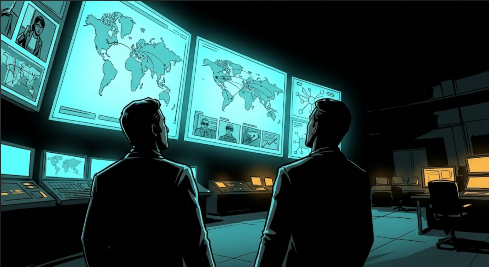

# GRID-9 // Truth Node



> **"Truth decays at 2.4M views per hour. We are the last checkpoint."**

GRID-9 is a highly interactive, frontend-only simulation of a real-time deepfake and synthetic media detection console. Designed for high-stakes intelligence and verification, it puts the operator (a "Human-in-the-Loop") at the center of the fight against viral disinformation. 

This project was built to demonstrate how tactical, rapid-response UI can be used to triage and analyze AI-generated media before it reaches critical mass.

## ✨ Features

- **Triage Queue:** A dynamic priority list of incoming viral videos, ranked by threat level and current reach velocity.
- **Frame-by-Frame Heatmap:** A visual scrubber that breaks down a video into frames, highlighting exactly where the AI detected synthetic markers (like face-warp or eye-flicker).
- **Signal Metadata:** Deep forensic data visualizations (compression artifacts, device fingerprints, audio waveforms) using Recharts.
- **Verdict Console:** The action center where the operator must make a call (AUTHENTIC, SYNTHETIC, INCONCLUSIVE) against a ticking countdown clock and a rapidly climbing "views" counter.
- **Verdict Archive:** A permanent, filterable record of all past decisions.

## 🛠️ Tech Stack

- **Framework:** React 18 + Vite
- **Styling:** Tailwind CSS (with custom design tokens, glitch animations, and CRT scanline effects)
- **Animation:** Framer Motion (for page transitions, pulse effects, and panel reveal animations)
- **Charts:** Recharts (for audio waveform and confidence gauges)
- **Icons:** Lucide-React
- **Routing:** React Router DOM

## 🚀 Getting Started

To run the GRID-9 Truth Node locally:

1. **Clone the repository**
   ```bash
   git clone <your-repo-url>
   cd LitCoders
   ```

2. **Install dependencies**
   ```bash
   npm install
   ```

3. **Start the development server**
   ```bash
   npm run dev
   ```

4. **Open in browser**
   Navigate to `http://localhost:5173/`

## 🎨 Art Style & Assets

The UI utilizes a strict cyber-espionage color palette (Void Black, Cyan, Alert Red, and Amber). Background and thumbnail assets are styled after retro spy thriller comic book illustrations (inspired by the board game *Codenames*), featuring heavy chiaroscuro shadows and flat colors.

## 📁 Project Structure

```text
src/
├── components/
│   ├── heatmap/    # FrameGrid and TimelineScrubber
│   ├── layout/     # TopBar and StatusStrip
│   ├── queue/      # TriageQueue list and items
│   ├── shared/     # Reusable UI (TacticalPanels, GlowText, Scanlines)
│   └── verdict/    # The main interaction console and countdown
├── context/        # ConsoleContext (useReducer for global state)
├── data/           # Mock data (Queue, Frames, Metadata, History)
├── pages/          # Routing pages (Landing, Console, Archive, About)
└── index.css       # Custom Tailwind utilities and keyframe animations
```

## 📜 License

This project was built for demonstration purposes. Feel free to fork and modify!
